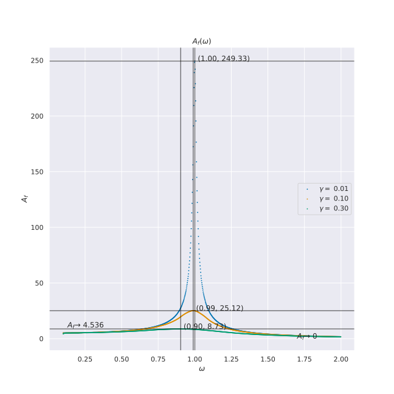
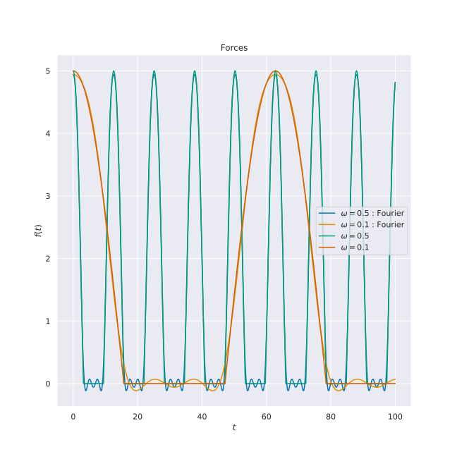
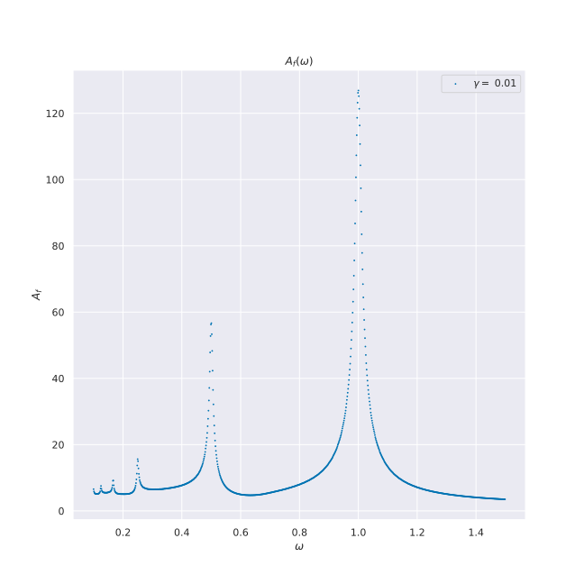
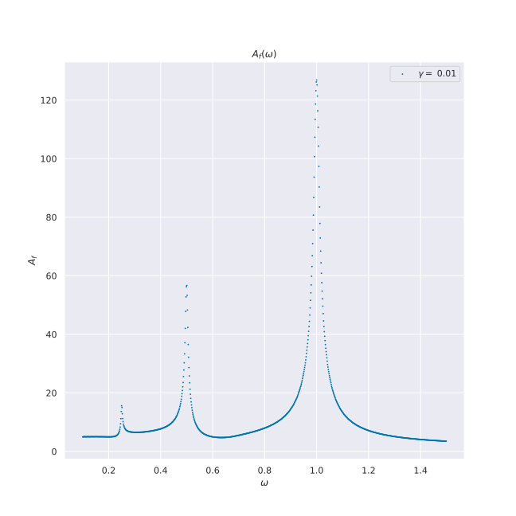

# Pendulum: Forced Oscillations.

## Predictor–corrector method for solving Pendulum Differential Equation

φ̈ + 2γφ̇ + ω₀²φ = f(t),

We know the analytical solution is: 

φ(t) = A e^(-γt) cos(ωᵣt + δ) + A_f cos(ωt + δ_f),

ωᵣ= √(ω₀² - γ²)

where A_f and δ_f don't depend on initial values.

We see that with time, the first term goes to zero. 

So we will solve for A_f(ω)

1. f(t) = f₀ cos(ωt)

2. f(t) = f₀ cos(ωt), if cos(ωt) > 0, else 0

3. f(t) = f₀ (1 / π + 1 / 2 cos(ωt) + 2 / (3π) cos(2ωt) - 2 / (15π) cos(4ωt))

